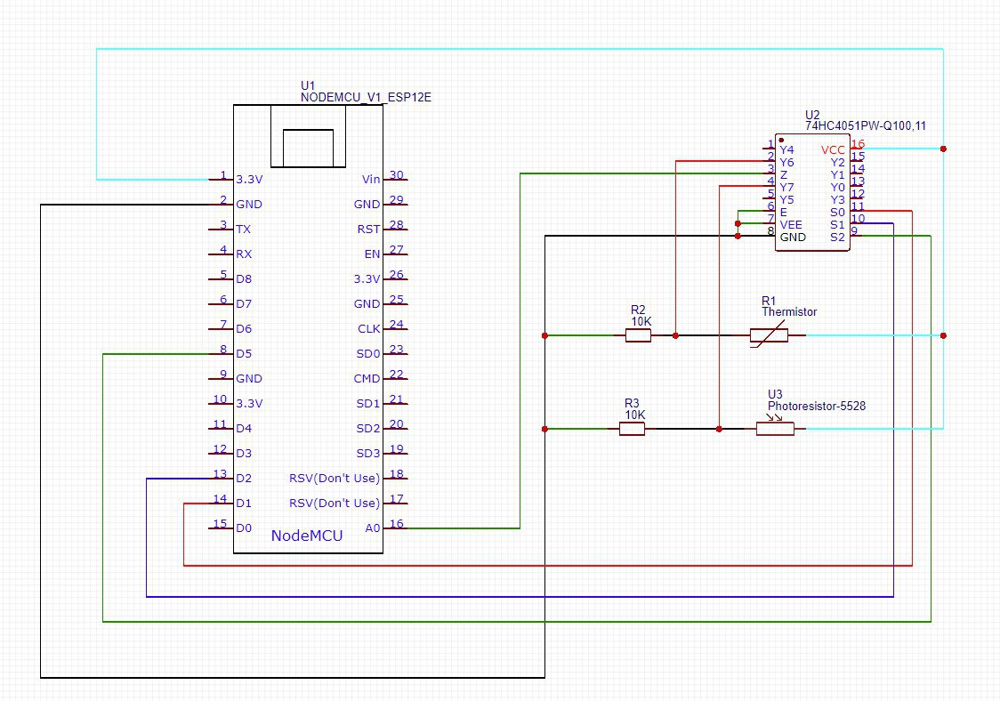
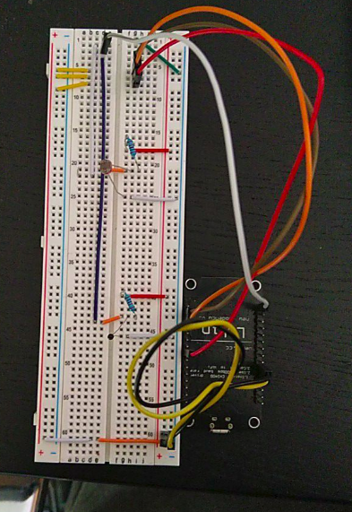

# Aufbau der NodeMCU Struktur

Notwendige Hardware:
* NodeMCU (ESP8266 Mikrocontroller)
* 10k Ohm Thermistor
* 10k Ohm Photoresistor 
* IN4051AN Multiplexer
* 2 10k Ohm Widerstände
* Breadboard
* diverse Verbindungskabel

Hier wird ein Multiplexer benötigt da die NodeMCU nur einen Analogen Pin besitzt. Es werden allerdings 2 analoge 
Sensoren eingesetzt. In diesem Szenario hilft ein Multiplexer, dadurch kann über ein digitales Schalten mit einem 
Analogen Pin bis zu 8 analoge Sensoren angesteuert werden.

Es werden außerdem 2 verschiedene Formlend benötigt um die Differenz Widerstandswerte in uns bekannte Einheiten zu 
rechnen. 

Plan:

Realer Aufbau:

